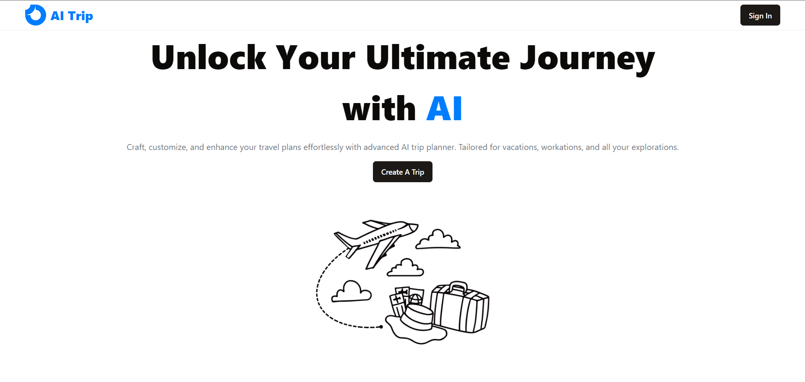
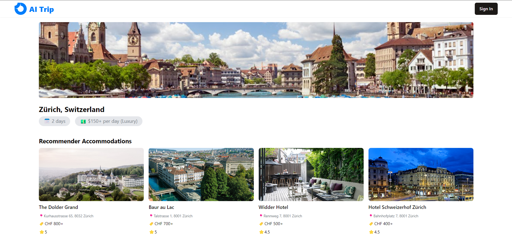

# AI Trip Planner Web App


## Table of Contents
1. [Introduction](#introduction)
2. [Technologies Used](#technologies-used)
3. [Features](#features)
4. [Problem Solved](#problem-solved)
5. [Getting Started](#getting-started)

## Introduction
The Trip Planner AI web app helps users create and plan vacations and trips using AI . It simplifies the process of organizing trips based on user preferences and provides personalized recommendations.

## Technologies Used


- **Frontend**: React, TailwindCSS, Shadcn, JavaScript 
- **Framework**: Vite
- **Authentication**: Google Auth
- **Database**: Firestore
- **AI Model**: Google Gemini
- **Hosting**: Vercel
- **APIs**: Google Maps, Google Geocoding, Google Places, Google Images

## Features
- **Personalized Trip Planning**: Create custom travel plans based on your preferences.
- **Hotel and Restaurant Recommendations**: Get suggestions for accommodations and dining options.
- **Activity Scheduling**: Plan daily activities tailored to your interests.
- **Trip Management**: Store and review previous trips.

### User Preferences
The app collects the following user preferences to tailor the trip planning experience:
- **Destinations**: Accepts up to two destinations.
- **Date Ranges**: Specify the start and end dates for each destination.
- **Budget**: Set your budget for the trip.
- **Number of People**: Indicate how many people are traveling.
- **Transportation Preferences**: Choose your preferred mode of transportation.
- **Accommodation Preferences**: Select between hotel or hostel.
- **Activity Preferences**: Choose from sightseeing, nightlife, shopping.
- **Meal Preferences**: Specify preferences for dinner, lunch.


### Recommendations
Based on the user preferences, the app provides:
- **Hotel Recommendations**: Information on price per night, rating, and more.

- **Daily Plans**: Activities and itineraries tailored to your preferences.

- **Restaurant Recommendations**: Dining options for each meal based on your preferences.

### Trip Management
The app stores previous trips and lists them for users, allowing easy access and review. This feature helps users keep track of their travel history and revisit past plans.

## Problem Solved
The Trip Planner AI web app addresses the complexity of trip planning by providing an all-in-one solution. It:
- Simplifies the planning process by offering tailored recommendations.
- Helps discover new places, activities, and dining options.
- Saves time and effort by generating comprehensive travel plans based on user inputs.
- Allows users to manage and review their trip history.

## Getting Started
1. **Clone the Repository**: `git clone https://github.com/yourusername/trip-planner-ai.git`
2. **Install Dependencies**: `npm install`
3. **Prepare the `.env.local` File**: Create a `.env.local` file in the root directory with the following format:
    ```plaintext
    VITE_APP_GOOGLE_PLACES_API_KEY=
    VITE_APP_GOOGLE_GEMINI_API_KEY=
    VITE_APP_GOOGLE_FIREBASE_API_KEY=
    VITE_GOOGLE_AUTH_CLIENT_ID=
    ```
4. **Run the App**: `npm run dev`
